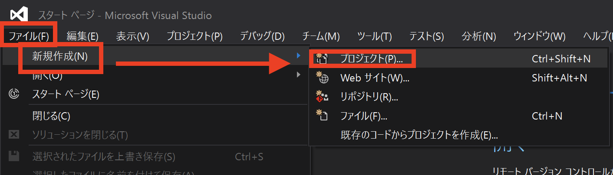
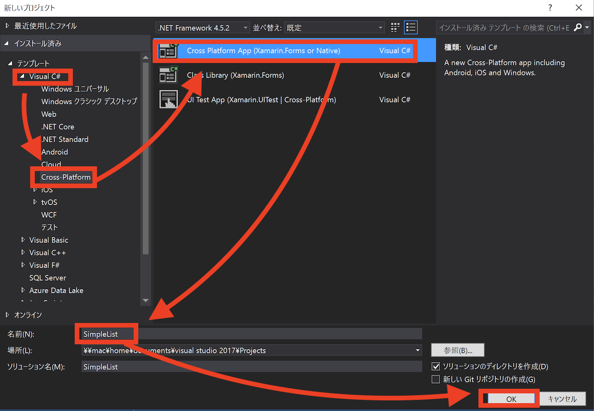
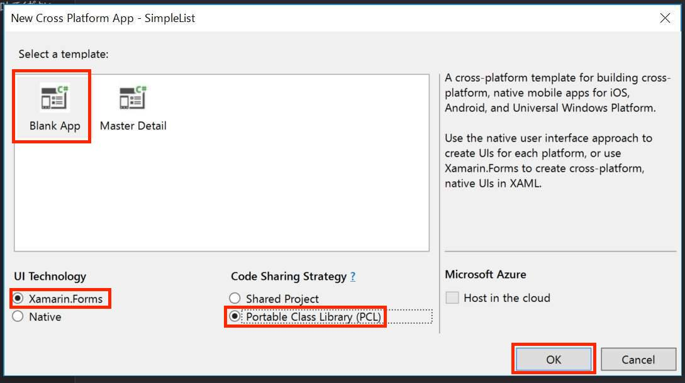
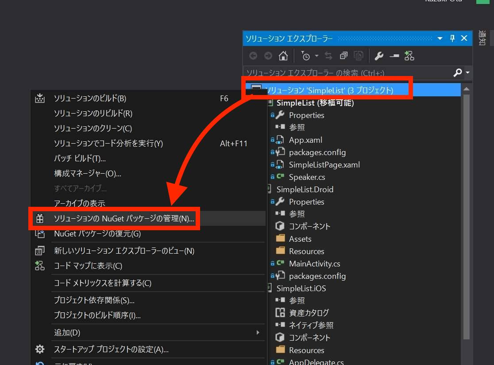
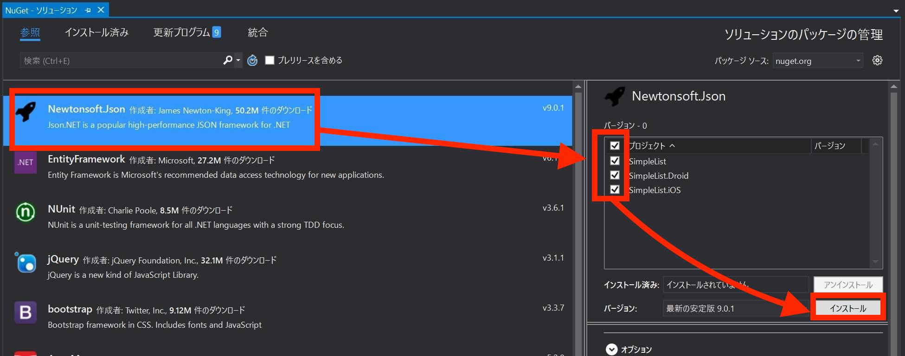

# Simple List App

Xamarin ハンズオン用の、簡単なアプリ制作の手順書です。

JSON を引っ張ってきて、それをリストビューに表示させる、簡単なアプリです。

## 開発環境

Windows でも Mac でも良いです。

|OS|OS のバージョン|要インストール済|
|----|----|----|
|Windows|Windows 10|Xamarin インストール済みの Visual Studio 2017|
|Mac OS X|10.11 ("El Capitan") 以降 |Visual Studio for Mac と 最新の Xcode |


## 完成形


使うサンプルJSONは[こちら](http://demo4404797.mockable.io/speakers)です。（本社の Xamarin チームの

```js
[
    {
        "Name": "Matthew Soucoup",
        "Description": "Matthew is a Xamarin MVP and Certified Xamarin Developer from Madison, WI. He founded his company Code Mill Technologies and started the Madison Mobile .Net Developers Group.  Matt regularly speaks on .Net and Xamarin development at user groups, code camps and conferences throughout the Midwest. Matt gardens hot peppers, rides bikes, and loves Wisconsin micro-brews and cheese.",
        "Image": "http://i.imgur.com/y4dzyT3.jpg",
        "Title": "Architect",
        "Company": "Code Mill Technologies",
        "Website": "https://codemilltech.com",
        "Blog": "https://codemilltech.com/",
        "Twitter": "codemillmatt",
        "Email": "MSoucoup@newco.com",
        "Avatar": "http://i.imgur.com/RTDt4nb.jpg"
    },
    {
        "Name": "James Montemagno",
        "Description": "James is a Principal Program Manager at Xamarin",
        "Image": "https://blogs.office.com/wp-content/uploads/2015/04/JamesM.jpg",
        "Title": "Principal PM",
        "Company": "Microsoft",
        "Website": "https://motzcod.es",
        "Blog": "https://motzcod.es/",
        "Twitter": "jamesmontemagno",
        "Email": "MSoucoup@newco.com",
        "Avatar": "https://blogs.office.com/wp-content/uploads/2015/04/JamesM.jpg"
    },
    {
        "Name": "Star Simpson",
        "Description": "A robot-builder from an early age, Star has explored robotics and automation in electronics and software from MIT to Shenzhen. She previously worked on some of the first robots to demonstrate human emotional expressiveness in Cynthia Brezeal’s personal robotics lab. Her interest carried her into the aerial robotics world, exploring drone-based delivery through TacoCopter many years ahead of anyone else. Now residing in SF, she’s looking for ways that tech can advance and extend human capability.",
        "Image": "http://i.imgur.com/mqRwv84.jpg",
        "Title": "Consultant",
        "Company": "",
        "Website": "N/A",
        "Blog": "N/A",
        "Twitter": "starsandrobots",
        "Email": "SSimpson@newco.com",
        "Avatar": "http://i.imgur.com/BlC5zlJ.jpg"
    },
    (略)
]
```

## 「新規作成」

`Xamarin.Forms` アプリの「新規作成」をしましょう。

* Xamarin.Forms
* 共通部分は PCL
* アプリの名前は何でもいい。私は "`SimpleList`"にした。同じにしておくとコピペが楽かも？（`namespace`がアプリ名になるので）

Visual Studio for Windows の場合、

「ファイル」→「新規作成」→「プロジェクト」



テンプレートの中から Xamarin のものを選びます。    
「Visual C#」→「Cross Platform」→「Cross Platform App」→（プロジェクト名編集）→「OK」



以下のように選んで「OK」




`Visual Studio for Mac` での「新規プロジェクト作成」の方法は [こちら](https://blogs.msdn.microsoft.com/chomado/xamarin/tried-creating-an-app-using-visual-studio-for-mac/)から。


## Speakerクラスを作る(新しいファイル)

共通部分のプロジェクト名を右クリック「追加」「新しいファイル」

クラス名は「Speaker」にして作成。新しいファイル`Speaker.cs`が生える。

今こんな感じ：

```csharp
using System;
namespace SimpleList
{
    public class Speaker
    {
        public Speaker()
        {
        }
    }
}
```

これに新しいプロパティを生やす。     
こうする：


```csharp
using System;
namespace SimpleList
{
    public class Speaker
    {
        public Speaker()
        {
        }
        // プロパティ群
        public string Id { get; set; }
        public string Name { get; set; }
        public string Description { get; set; }
        public string Website { get; set; }
        public string Title { get; set; }
        public string Avatar { get; set; }
    }
}
```

## 見た目の作成（画面）

`SimpleListPage.xaml` (もしくは `MainPage.xaml`)を開きます。これは見た目を定義しているファイルです。    
XAML (ざむる) とは、Micorosft による、主にUIを書くために用いられるマークアップ言語です。(XMLベースの言語)

`SimpleListPage.xaml`は、最初はこうなっています。

```xml
<?xml version="1.0" encoding="utf-8"?>
<ContentPage
    xmlns="http://xamarin.com/schemas/2014/forms"
    xmlns:x="http://schemas.microsoft.com/winfx/2009/xaml"
    xmlns:local="clr-namespace:SimpleList"
    x:Class="SimpleList.SimpleListPage">
    <Label
        Text="Welcome to Xamarin Forms!"
        VerticalOptions="Center"
        HorizontalOptions="Center" />
</ContentPage>
```

この `ContentPage` の中を書き換えて行きましょう。まず `Label` を消して、代わりに次のコードを差し込みます。

```xml
<!-- iOSでの上の余白を考慮 -->
<ContentPage.Padding>
    <OnPlatform x:TypeArguments="Thickness" iOS="0,20,0,0" />
</ContentPage.Padding>
<!-- コンテンツ(ボタンとList) -->
<StackLayout>
    <Button Text="データを読み込む" VerticalOptions="Start" />
    <ListView x:Name="speakerListView" VerticalOptions="FillAndExpand" >
        <ListView.ItemTemplate>
            <DataTemplate>
                <ImageCell Text="{Binding Name}"
                    Detail="{Binding Title}"
                    ImageSource="{Binding Avatar}"/>
            </DataTemplate>
        </ListView.ItemTemplate>
    </ListView>
</StackLayout>
```

[参照](https://github.com/chomado/SimpleList/commit/1bcca73fb5158f954164b1738c2a518a0b29af05#diff-38d51864885559ed06aa5de8960947a9)


## JSON.NET パッケージを追加

JSONの扱いがめっちゃ楽になる超便利パッケージを入れましょう。

C# の場合は NuGet と呼ばれるパッケージマネージャを使います。

ソリューションを右クリックして「ソリューションの NuGet パッケージの管理」をクリック



NuGet パッケージマネージャが開くので、`JSON.NET` (`Newtonsoft.Json`)をクリックし、全てのプロジェクトを選択し「インストール」を押します。



これで JSON.NET が入りました。

（Mac の場合はソリューションでの一括パッケージ管理ができないので、プロジェクトごとにひとつひとつ入れていってください）

## "データを読み込む"ボタンが押された時の処理（イベント）

`SimpleListPage.xaml.cs` を開きます。（`SimpleListPage.xaml` のコードビハインドです。)

最初はこうなっています。

```csharp
using Xamarin.Forms;

namespace SimpleList
{
    public partial class SimpleListPage : ContentPage
    {
        public SimpleListPage()
        {
            InitializeComponent();
        }
    }
}
 ```

ここに、「データを読み込む」ボタンが押された時の処理を書きます。
読み込むボタンが押されたら [こちらのJSON](http://demo4404797.mockable.io/speakers)を引っ張ってきて、よしなに表示させたいですよね。

まず、必要な using 句を追加します。

```csharp
using System;
using System.Collections.Generic;
using System.Net.Http;
using Newtonsoft.Json;
```

そして、コンストラクタの直後あたりに、次のコードを付け足してください。

```csharp
// "データを読み込む"ボタンが押された時の処理（イベント）
private async void OnClick(object sender, EventArgs e)
{ 
    // HttpClient が不要になったら解放されるようにしている。(using というのは、解放しなければならないリソースを自動で解放してくれる構文)
    using (var client = new HttpClient())
    {
        var jsonUrl = "http://demo4404797.mockable.io/speakers";

        //サーバーから json を取得します
        var json = await client.GetStringAsync(jsonUrl);

        //json をデシリアライズします
        var items = JsonConvert.DeserializeObject<List<Speaker>>(json);

        // ListView に データを設定している　
        this.speakerListView.ItemsSource = items;
    }
}
```

そして、ボタンが押された時にこの `OnClick` が呼ばれるように、XAML側に Clicked イベント呼び出しを書いておきましょう。

現在こうなっています：    
```xml
<Button Text="データを読み込む" VerticalOptions="Start" />
```

こうしてください：    
```xml
<Button Text="データを読み込む" VerticalOptions="Start" Clicked="OnClick" />
```


[参考](https://github.com/chomado/SimpleList/commit/924ae671e78d170cb20a322ad222c2a992ad76a0)

で、「実行」してみてください。完成です
