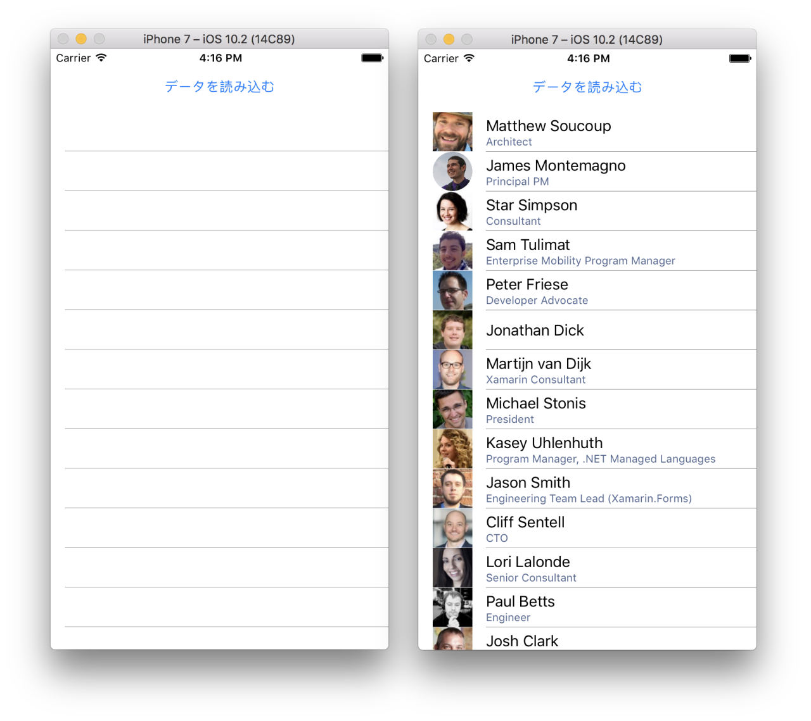

# Simple List App

Xamarin ハンズオン用の、簡単なアプリ制作の手順書です。

JSON を引っ張ってきて、それをリストビューに表示させる、簡単なアプリです。

## 完成形



使うサンプルJSONは[こちら](http://demo4404797.mockable.io/speakers)です

```js
[

      {
        "Name": "Matthew Soucoup",
        "Description": "Matthew is a Xamarin MVP and Certified Xamarin Developer from Madison, WI. He founded his company Code Mill Technologies and started the Madison Mobile .Net Developers Group.  Matt regularly speaks on .Net and Xamarin development at user groups, code camps and conferences throughout the Midwest. Matt gardens hot peppers, rides bikes, and loves Wisconsin micro-brews and cheese.",
        "Image": "http://i.imgur.com/y4dzyT3.jpg",
        "Title": "Architect",
        "Company": "Code Mill Technologies",
        "Website": "https://codemilltech.com",
        "Blog": "https://codemilltech.com/",
        "Twitter": "codemillmatt",
        "Email": "MSoucoup@newco.com",
        "Avatar": "http://i.imgur.com/RTDt4nb.jpg"
      },
       {
        "Name": "James Montemagno",
        "Description": "James is a Principal Program Manager at Xamarin",
        "Image": "https://blogs.office.com/wp-content/uploads/2015/04/JamesM.jpg",
        "Title": "Principal PM",
        "Company": "Microsoft",
        "Website": "https://motzcod.es",
        "Blog": "https://motzcod.es/",
        "Twitter": "jamesmontemagno",
        "Email": "MSoucoup@newco.com",
        "Avatar": "https://blogs.office.com/wp-content/uploads/2015/04/JamesM.jpg"
      },
      {
        "Name": "Star Simpson",
        "Description": "A robot-builder from an early age, Star has explored robotics and automation in electronics and software from MIT to Shenzhen. She previously worked on some of the first robots to demonstrate human emotional expressiveness in Cynthia Brezeal’s personal robotics lab. Her interest carried her into the aerial robotics world, exploring drone-based delivery through TacoCopter many years ahead of anyone else. Now residing in SF, she’s looking for ways that tech can advance and extend human capability.",
        "Image": "http://i.imgur.com/mqRwv84.jpg",
        "Title": "Consultant",
        "Company": "",
        "Website": "N/A",
        "Blog": "N/A",
        "Twitter": "starsandrobots",
        "Email": "SSimpson@newco.com",
        "Avatar": "http://i.imgur.com/BlC5zlJ.jpg"
      },
      (略)
    ]
```

## 「新規作成」

to be written

## Speakerクラスを作る(新しいファイル)

to be written

## 見た目の作成（画面）

to be written

## JSON.NET パッケージを追加

to be written

## "データを読み込む"ボタンが押された時の処理（イベント）

to be written
